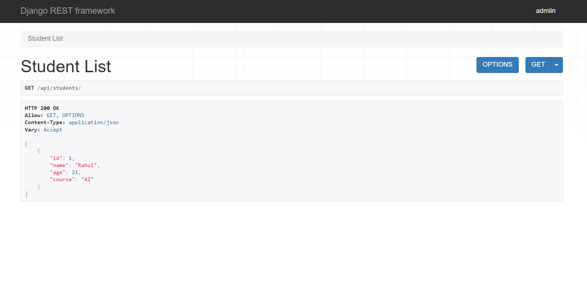
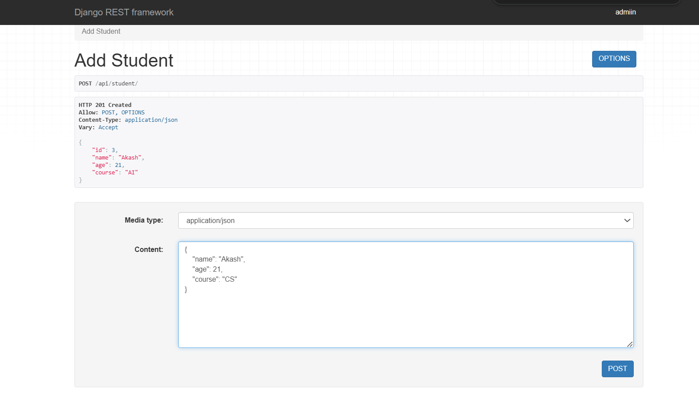
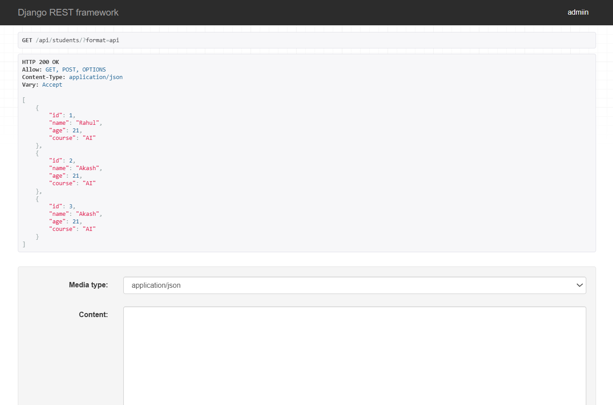
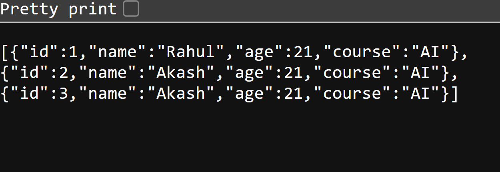
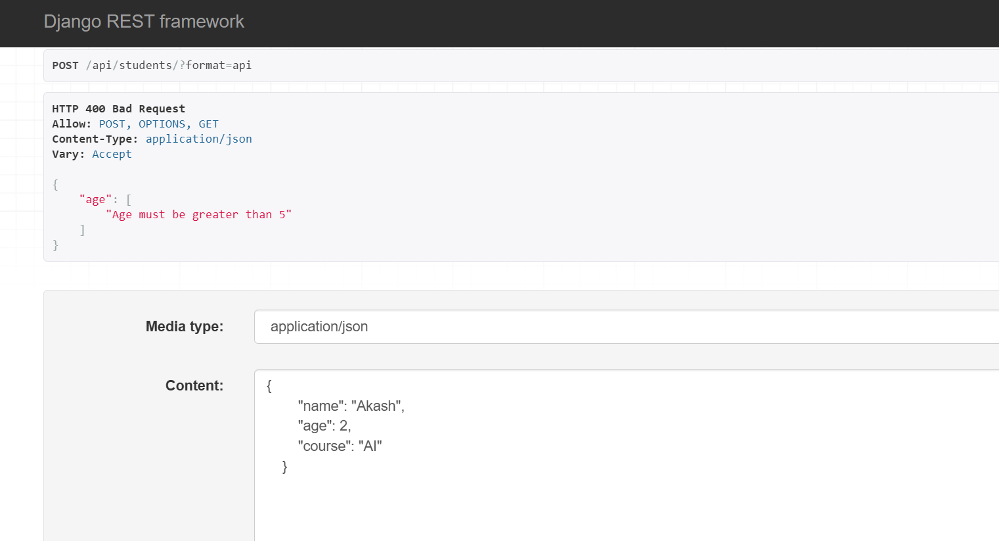
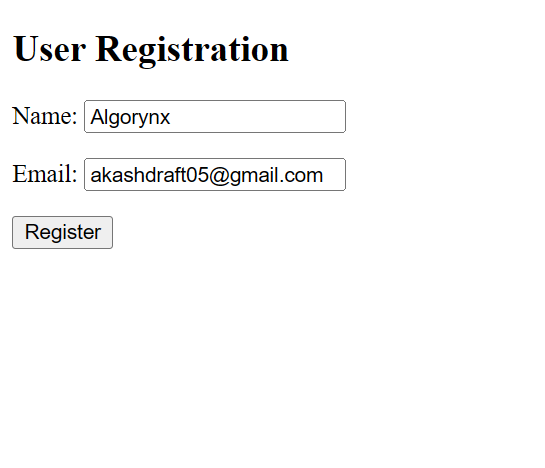
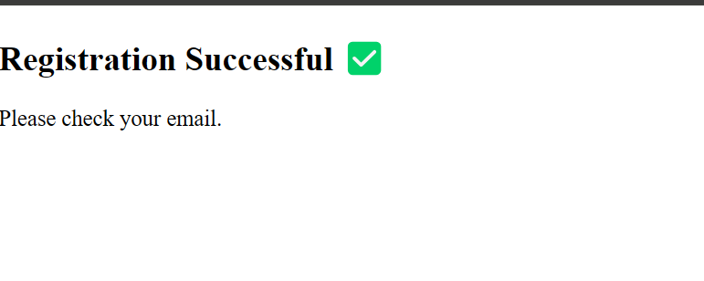
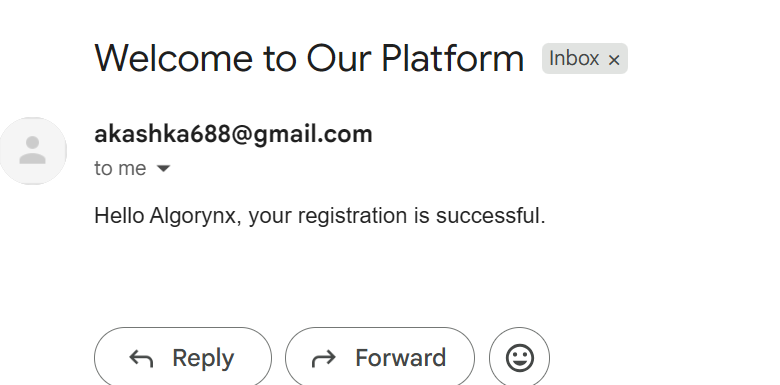

# ASSIGNMENT TASK-1 #

DEMO:

1. core/urls.py

from django.urls import path
from .views import student_list

urlpatterns = [
    path('students/', student_list),
]

2. core/models.py

from django.db import models

class Student(models.Model):
    name = models.CharField(max_length=100)
    age = models.IntegerField()
    course = models.CharField(max_length=100)

    def __str__(self):
        return self.name

3. core/views.py

from rest_framework.decorators import api_view
from rest_framework.response import Response
from .models import Student

@api_view(['GET'])
def student_list(request):
    students = Student.objects.all()

    data = [
        {
            "id": student.id,
            "name": student.name,
            "age": student.age,
            "course": student.course
        }
        for student in students
    ]

    return Response(data)

# ASSIGNMENT TASK-2 #

1. core/views.py

from rest_framework.decorators import api_view
from rest_framework.response import Response
from rest_framework import status
from .models import Student
from .serializers import StudentSerializer

@api_view(['POST'])
def add_student(request):
    serializer = StudentSerializer(data=request.data)
    
    if serializer.is_valid():
        serializer.save()
        return Response(serializer.data, status=status.HTTP_201_CREATED)
    
    return Response(serializer.errors, status=status.HTTP_400_BAD_REQUEST)

2. core/serializers.py

from rest_framework import serializers
from .models import Student

class StudentSerializer(serializers.ModelSerializer):
    class Meta:
        model = Student
        fields = '__all__'

3. core/models.py

from django.db import models

class Student(models.Model):
    name = models.CharField(max_length=100)
    age = models.IntegerField()
    course = models.CharField(max_length=100)

    def __str__(self):
        return self.name

DEMO:

#  ASSIGNMENT TASK-3 #

1. core/views.py

from rest_framework.decorators import api_view
from rest_framework.response import Response
from rest_framework import status
from .models import Student
from .serializers import StudentSerializer

@api_view(['GET', 'POST'])
def student_list(request):

    # 🔹 GET Method
    if request.method == 'GET':
        students = Student.objects.all()
        serializer = StudentSerializer(students, many=True)
        return Response(serializer.data)

    # 🔹 POST Method
    elif request.method == 'POST':
        serializer = StudentSerializer(data=request.data)

        if serializer.is_valid():
            serializer.save()
            return Response(serializer.data, status=status.HTTP_201_CREATED)

        return Response(serializer.errors, status=status.HTTP_400_BAD_REQUEST)

2. core/serializers.py

from rest_framework import serializers
from .models import Student

class StudentSerializer(serializers.ModelSerializer):
    class Meta:
        model = Student
        fields = '__all__'

DEMO: 

# ASSIGNMENT TASK-4 #

core/serializers.py

from rest_framework import serializers
from .models import Student

class StudentSerializer(serializers.ModelSerializer):

    class Meta:
        model = Student
        fields = '__all__'

    def validate_age(self, value):
        if value <= 5:
            raise serializers.ValidationError("Age must be greater than 5")
        return value

DEMO:

# ASSIGNMENT TASK-5 #

## EMAIL ##

1. core/forms.py

from django import forms
from .models import RegisteredUser

class RegistrationForm(forms.ModelForm):
    class Meta:
        model = RegisteredUser
        fields = ['name', 'email']

2. core/models.py

from django.db import models

class RegisteredUser(models.Model):
    name = models.CharField(max_length=100)
    email = models.EmailField(unique=True)
    created_at = models.DateTimeField(auto_now_add=True)

    def __str__(self):
        return self.email

3. Settings.py

EMAIL_BACKEND = 'django.core.mail.backends.smtp.EmailBackend'
EMAIL_HOST = 'smtp.gmail.com'
EMAIL_PORT = 587
EMAIL_USE_TLS = True

EMAIL_HOST_USER = "***************"
EMAIL_HOST_PASSWORD = "***************"
DEFAULT_FROM_EMAIL = EMAIL_HOST_USER

DEMO:

